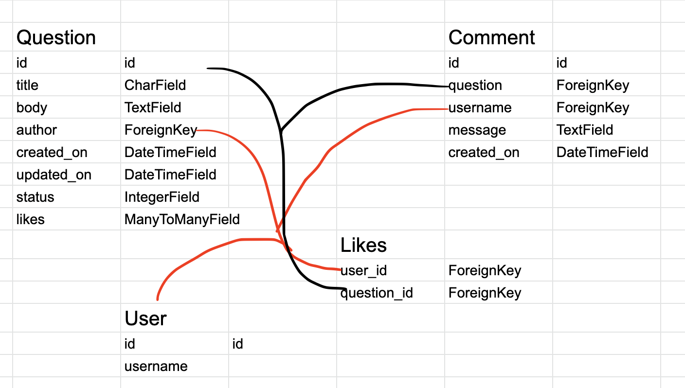
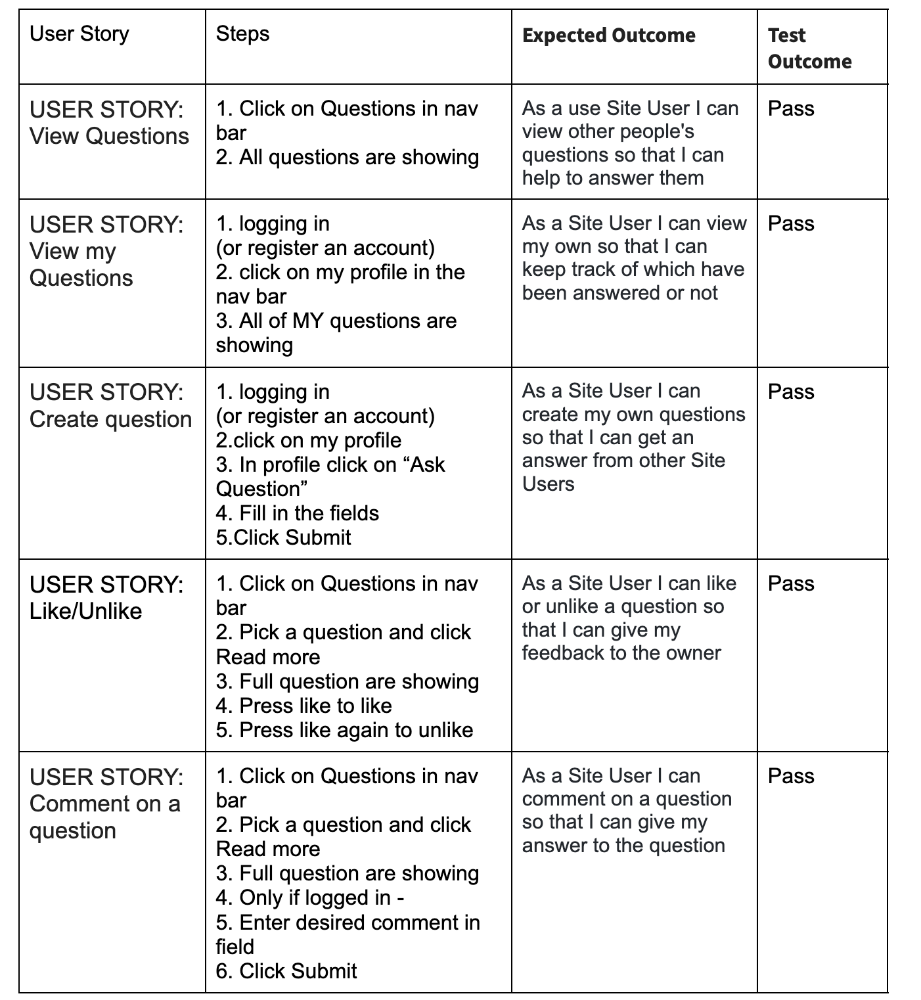
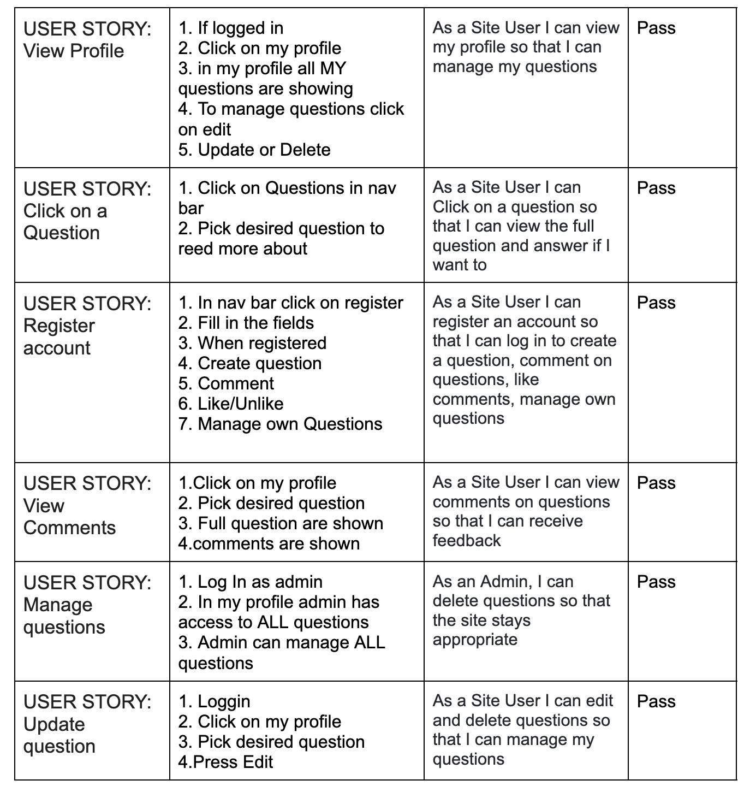

# Traint
---

## About
---

### UX (User Experience)
---

* USER STORY: View Questions. 
    - As a use Site User I can view other people's questions so that I can help to answer them.
* USER STORY: View my Questions. 
   -  As a use Site User I can view other people's questions so that I can help to answer them.
* USER STORY: Create question.
    - As a Site User I can cerate my own questions so that I can get an answer from other Site Users
* USER STORY: Like/Unlike 
   -  As a Site User I can like or unlike a question so that I can give my feedback to the owner
* USER STORY: Comment on a question 
   -  As a Site User I can comment on a question so that I can give my answer to the question
* USER STORY: View Profile 
   -  As a Site User I can view my profile so that I can manage my questions
* USER STORY: Click on a Question 
   -  As a Site User I can Click on a question so that I can view the full question and answer if I want to
* USER STORY: Register account 
   -  As a Site User I can register an account so that I can log in to create a question, comment on questions, like comments, manage own questions
* USER STORY: View Comments 
    - As a Site User I can view comments on questions so that I can receive feedback
* USER STORY: Manage questions 
    - As an Admin, I can delete questions so that the site stays appropriate
* USER STORY: Update question 
    - As a Site User I can edit and delete questions so that I can manage my questions

### Design
---

* The design of the web application meets accessibility guidelines, presents a structured layout and follows the principles of UX design and navigation model
* Contrast between background and foreground colors to help the visually impaired
* The graphics are consistent in style and color throughout the site.
* The overall style of the application is to be minimalistic.
    - A minimalistic design is working to get the user to the goal faster.
    - No distraction from the goal 
    - Easy navigation

* Wireframes

### Choice of color
---

* The color scheme is based on the color blue.
    - The color blue is peace, tranquillity, calmness and serenity, helping to reduce anxiety, aggression.
    - Training should never be stressfull and by using a blue tone reducec the risk of agitating site users with STRONG color

### Responsive Design
---
* The site is responsive to all devices (desktop, mobile, tablet).

## Features
---

#### Home Page

 

* Navbar: Showing the different pages on the site
    * Looks different if you are not logged in

 

* Footer: at the bottom with Logo and copyright symbol
* Home Text: The text is to get the Site visitor intrigued to know more about what you can do on the site

### Questions

 

* All Question: This page is the page where all questions are renderd.
* The user can se title, author: If the title seems intresting for the user they can click on read more to be redirected to the Full Question

### Full Question

 

* Shows full question with: author, title, when posted, number of likes, number of comments

* Comments
    * user, when, comment

* Comment
    * if the user is logged in the user can choose to leave a comment

### My Profile

 

* Intro, Name, Ask

 

* My Questions
* Edit

### Ask Question

 

* Form

### Edit Question

 

* Form
    * Prepopulated
    * Delete option

### Register

 

* Form

### Login

 

* Form

### Logout

 

* Form

## Technologies used
---

* Languages
    * HTML.
    * CSS.
    * JavaScript.
    * Python.

* Frameworks libraries & programs Used
    * Django
    * Git
    * Github
    * Bootstrap
    * Gunicorn
    * dj_database_url
    * psycopg2
    * Cloudinary
    * Summernote
    * Django allauth
    * Django crispy forms

## Testing
---

### Validator Testing

#### [Html](documentation/img/hvalidation.jpg) 

Templates 
* Base.html
* Index.html
* Question.html
* Full_Question.html
* User_Profile.html
* Add_Question.html
* Register.html
* Login.html
* Logout.html
* Edit_Question.html

 

#### [CSS](documentation/img/AdminPy.jpg)

* style.css

 

#### Javascript

* script.js, validated with [jshint](https://jshint.com/)

 

#### Python

* Forum
    * [ admin.py](documentation/img/AdminPy.jpg)
    * [forms.py](documentation/img/formsPy.jpg)
    * [models.py](documentation/img/ModelsPy.jpg)
    * [urls.py](documentation/img/urls.jpg)
    * [views.py](documentation/img/viewsPy.jpg)

* Traint
    * [settings.py](documentation/img/settingsPy.jpg)
    * [urls.py](documentation/img/settingsPy.jpg)

 

### Manual testing

 

## Deployment
---

* Deployment steps followed:
    1. Create the Heroku app .
    1. Attach the PostgreSQL
    1. Prepare environment and settings.py files
    1. Get our static and media files stored on Cloudinary

 

* Heroku
    1. “pip3 install django gunicorn” in the terminal, using gunicorn to be the server to run Django on heroku.
    1. “pip3 install dj_database_url psycopg2

 

* To run Cloudinary 
    1. pip3 install dj3-cloudinary-storage
    1. Create the requirements.txt file: pip3 freeze –local >requirements.txt

 

* To create a new Django project
    1. “django-admin start project traint .”
    1. Create the app: “python3 manage.py startapp forum”

 

* In our settings.py file
    1. in the installed app section add: “forum” 

we now need to migrate this changes to the database
in the terminal: “python3 manage.py migrate”

 

#### Creat a app in heroku

1. You need to have an account on Heroku.com
2. Create a list of requirements that the project needs to run:
    * ype in this in the terminal: pip3 freeze > requirements.txt
    * (Now all of the requirements has been updated)
    * Commit and push the changes to GitHub
3. login to your account on Heroku or create one if needed.
4. Click on your profile and then the "create new app" button.
5. You will now create an app name and select a region.
    * This project chose traint-forum and the region Europe
    * The app name needs to be unique
6. when this is done click "create app"
7. In the Resources tab, Add a database: search for postgres in the Add-ons field (Heroku Postgres)
8. Open the settings tab before you deploy the code.
9. In setting, scroll down to the config Vars section
10. copy the DATABASE_URL

 

* In the code in the same directory as the manage.py create a file named “env.py”
    1. At the top import os
    1. Set a environment variable caller DATABASE_URL  (paste in url)
    1. Add your SECRET_KEY as well 
    1. copy your secret key value and go back to Heroku config vars.
    1. Add the secret_key value to a new config var called SECRET_KEY
    1. Reference the env.py in the setings.py file, by using:
        * import os 
        * import dj_database
    1. In setings.py add secret key value:
        * SECRET_KEY = os.environ.get('SECRET_KEY')
    1. In settings scroll down to DATABASES: 
        * DATABASES = {'default': dj_database_url.parse(os.environ.get('DATABASE_URL'))

Do not forget to migrate the changes

### Cloudinary

1. Create an account
1. Click on the Sign Up For Free button
1. Provide your name, email address and choose a password
1. For Primary interest, you can choose Programmable Media for image and video API
1. Optional: edit your assigned cloud name to something more memorable
1. Click Create Account
1. Verify your email and you will be brought to the dashboard

 

1. From the dashboard, copy the "API Environment variable" value by clicking on the "Copy to clipboard" link.
1. Go back to the env.py file add the value to CLOUDINARY_URL(remember to remove CLOUDINARY_URL= in the begining of the "API Environment variable")
1. Paste the same value into heroku as well in a config var named “CLOUDINARY_URL”
1. When starting your project add one temporary variable: 
    * DISABLE_COLLECTSTATIC assign it 1

 

* In settings.py under installed apps add:
    * ‘cloudinary_storage’
    * ‘cloudinary’

 

* At the end of settings.py add: 
    * STATICFILES_STORAGE = Cloudinary_storage.storage.StaticHashedCloudinaryStorage"
    * STATICFILES_DRS = [os.path.join(BASE_DIR, ‘static’)]
    * STATIC_ROOT = os.path.join(BASE_DIR, ‘static’)
    * MEDIA_URL = ‘/media/’
    * DEFAULT_FILE_STORAGE = ‘"Cloudinary_storage.storage.MediaCloudinaryStorage".

 

Tell django where our templates are stored by: 
* TEMPLATES_DIR = os.path.join(BASE_DIR, ‘templates’)
* Set the ‘DIRS’: [TEMPLATES_DIR]
* set  ALLOWED_HOSTS = [‘herokuappname.herokuapp.com’, ‘localhost’]
* Create a Procfile 
* Commit and push the changes to the repository

 

In Heroku 
1. Under deploy choose Github as deployment method
1. Search for the repository
1. then click on deploy branch

### Final Deployment

## Credits

